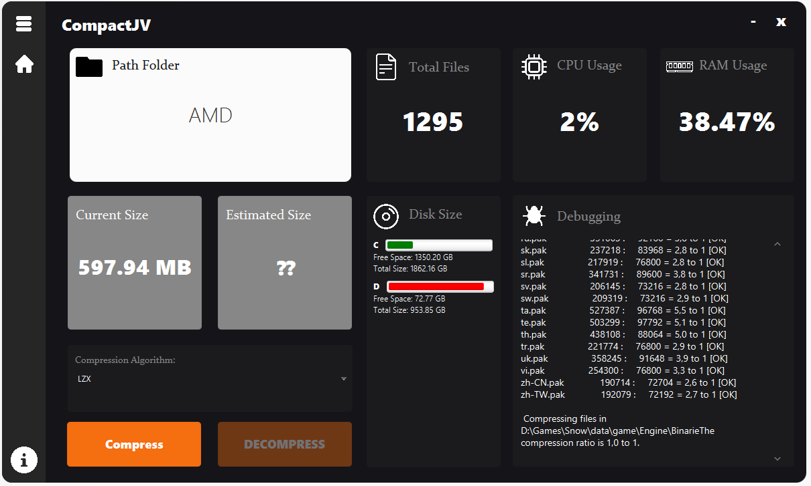
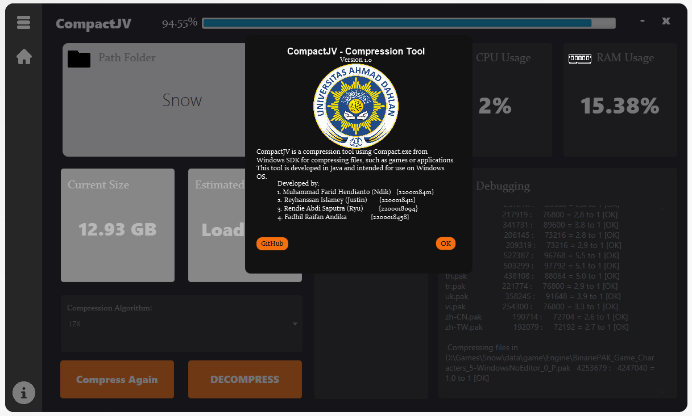
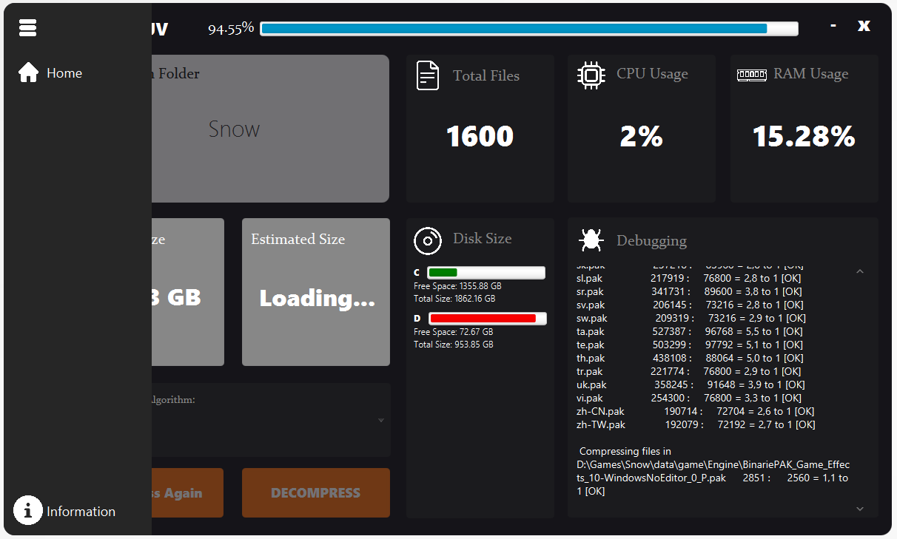
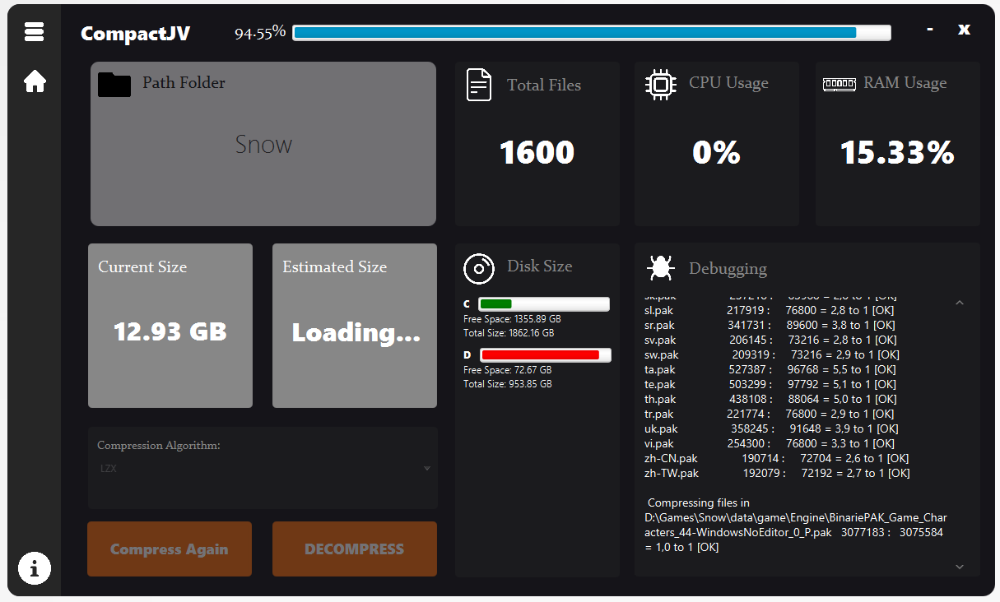

<p align="center">
  
  <h1 align="center">CompactJV</h1>


<p align="center">
    
    
    
    
    
    
   

____
</p>


**CompactJV** is a powerful compression tool developed using Java. It leverages the capabilities of Compact.exe from the
Windows SDK to compress files such as games or applications. Designed with Windows operating system users in mind,
CompactJV delivers high-performance file compression with the ease of use.

## Table of Contents

- [Demo](#demo)
- [How It Works](#how-it-works)
- [Usage](#usage)
- [Getting Started](#getting-started)
    - [Prerequisites](#prerequisites)
    - [Installation](#installation)
- [Contributing](#contributing)
- [License](#license)
- [Development Team](#development-team)
- [Acknowledgements](#acknowledgements)

## Demo

<p align="center">
  
  
  
  
</p>

## Getting Started

To get CompactJV running on your local machine for development and testing, follow the instructions below.

## How It Works

CompactJV uses the Compact.exe tool from the Windows SDK to compress files. It supports several compression algorithms,
including XPRESS4K, XPRESS8K, XPRESS16K, XPRESS, and LZX.

Here's a brief overview of how each algorithm works:

1. **XPRESS4K**: This is a fast compression algorithm that provides a reasonable compression ratio. The '4K' in its name
   refers to the size of the sliding window used during compression.

2. **XPRESS8K and XPRESS16K**: These are variations of the XPRESS4K algorithm. They use larger sliding windows of 8K and
   16K, respectively. This allows them to achieve better compression ratios, but at the cost of slower performance.

3. **XPRESS**: This algorithm provides a balance between performance and compression ratio. It's more efficient than
   XPRESS4K, XPRESS8K, and XPRESS16K, but not as powerful as LZX.

4. **LZX**: This is a very high-performance compression algorithm. It provides excellent compression ratios, but it's
   also quite slow compared to the other algorithms.

When you choose to compress a file with CompactJV, the program uses one of these algorithms to reduce the file's size.
The specific algorithm used depends on the options you select.

## Usage

Here's how to use CompactJV:

1. Select the file you want to compress.
2. Choose the compression algorithm you want to use.
3. Click the 'Compress' button.

CompactJV will then compress the file using the selected algorithm. The compressed file will be saved in the same
location as the original file.

Remember: the more powerful the compression algorithm, the longer it will take to compress the file. If speed is a
concern, you may want to use a faster algorithm like XPRESS4K or XPRESS. If you're more concerned about reducing the
file's size as much as possible, you may want to use a more powerful algorithm like LZX.

### Prerequisites

Please make sure you have the following software installed:

- [Java Development Kit (JDK 21)](https://www.oracle.com/java/technologies/downloads/#java21)
- Gradle
- [WIX v3](https://wixtoolset.org/docs/wix3/)
- [IntelliJ IDEA](https://www.jetbrains.com/idea/download/?section=windows) (optional)

### Installation

Follow these steps to get a local copy of CompactJV:

1. Ensure the required tools are installed.
2. Clone the CompactJV repository to your local machine.

    ```bash
    git clone https://github.com/IRedDragonICY/CompactJV.git
    ```

3. Navigate to the project directory.

4. Run this command to build the project:

    ```bash
    ./gradlew jpackage 
    ```

This command compiles the project and packages it into a distributable format.

## Contributing

We welcome contributions from developers. Feel free to fork the project, make your changes, and submit a pull request.

## License

This project is licensed under the MIT License. For more information, please refer to the `LICENSE` file in the project
repository.

## Development Team

This project is brought to you by a team of dedicated developers from Universitas Ahmad Dahlan:

1. **Muhammad Farid Hendianto (Ndik)** - _Student ID: 2200018401_
2. **Reyhanssan Islamey (Justin)** - _Student ID: 2200018411_
3. **Rendie Abdi Saputra (Ryu)** - _Student ID: 2200018094_
4. **Fadhil Raifan Andika** - _Student ID: 2200018458_

## Acknowledgements

We would like to express our gratitude to **Faisal Fajri Rahani S.Si., M.Cs.**, for his exemplary guidance and
unwavering support throughout the development of this project.
